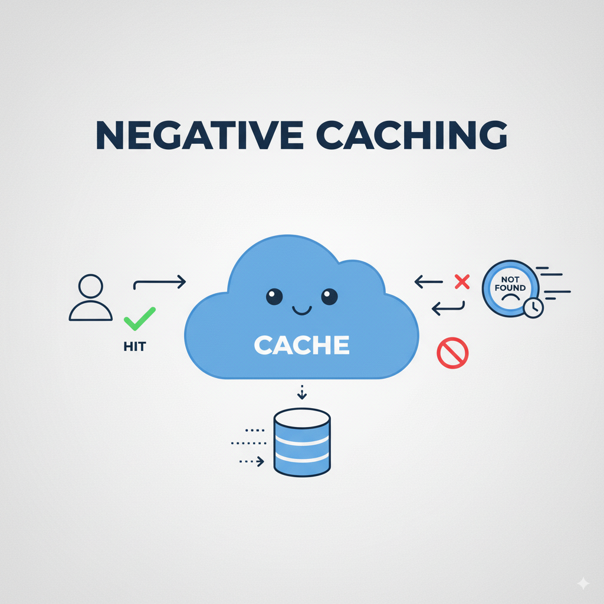
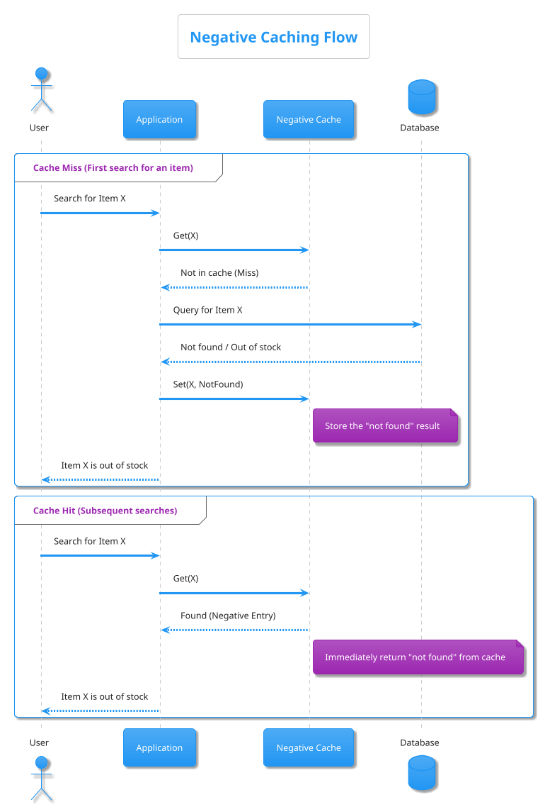
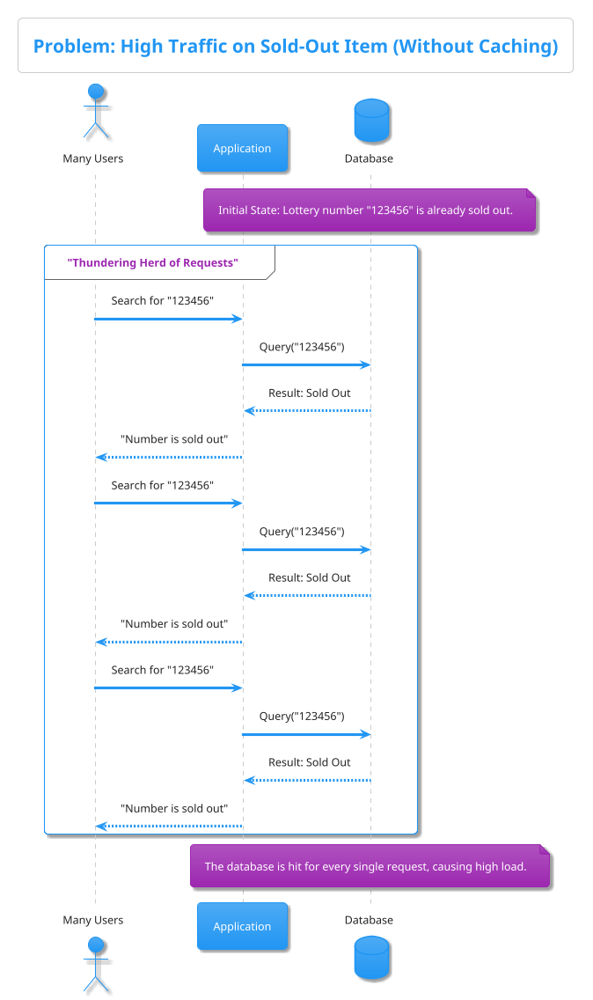
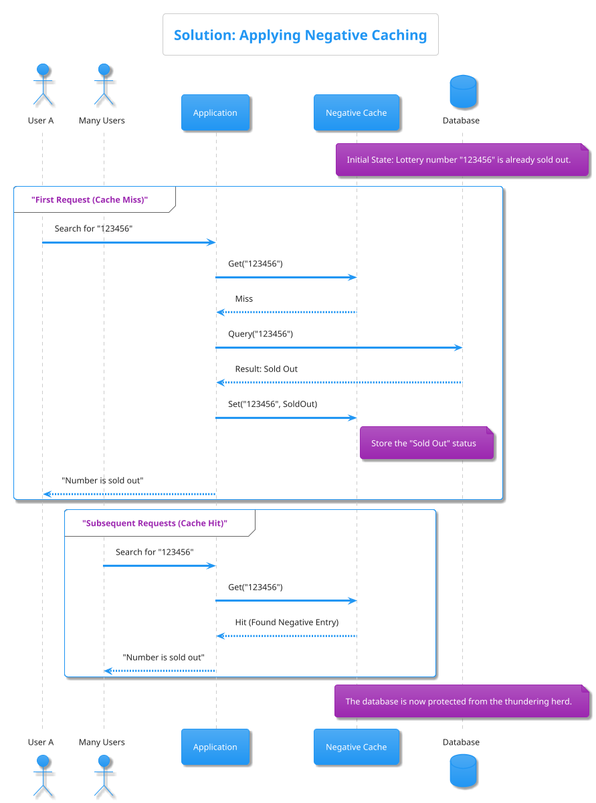

# System Design - Negative Caching with Base-n Encoding in Golang

Blog: <https://medium.com/@napatrc/system-design-negative-caching-with-base-n-encoding-in-golang-090080fadca0>

Negative Caching เป็นเทคนิคที่ช่วยลดภาระการ query ข้อมูลที่ไม่พบซ้ำๆ โดยเก็บผลลัพธ์ว่า "ไม่มีสิ่งนี้อยู่" ไว้ในแคช ทำให้สามารถตอบกลับ request ได้อย่างรวดเร็วขึ้นเพื่อช่วยลดโหลดในการ query ฐานข้อมูล



ในบทความนี้มีการแสดงเทคนิคอื่นๆ เพื่อเพิ่มประสิทธิภาพการทำงานของโปรแกรมด้วย Golang เช่น การเลือก type สำหรับ map key, การเลือกใช้ map value แบบ struct{}, การล้าง map และการกำหนดความจุล่วงหน้า Pre-allocate large map เป็นต้น ซึ่งจะช่วยลด overhead ของหน่วยความจำและเพิ่มความเร็วการทำงานของระบบได้ ซึ่งจะช่วยส่งผลให้ระบบบริการของเราทำงานได้เสถียรขึ้น รองรับทราฟิกหนักๆ ได้ดีขึ้น และลดต้นทุนด้านทรัพยากรลงได้ โดยในตอนท้ายได้มีการแสดงตัวอย่างการนำไปใช้งานเพื่อให้เห็นภาพชัดเจนขึ้น

## Negative Caching

คือการเก็บรักษาผลลัพธ์ของการค้นหาที่ล้มเหลวหรือไม่พบไว้ในแคช ทำให้คำขอซ้ำๆ ที่เป็นไปไม่ได้ (เช่น สินค้าไม่มีอยู่จริงหรือสินค้าหมดสต็อก) ได้ผลตอบรับเร็วขึ้นจากแคชโดยไม่ต้องไปสอบถามฐานข้อมูลซ้ำ
เทคนิคนี้ช่วยลดการประมวลผลซ้ำสำหรับคำขอที่ทราบอยู่แล้วว่าจะไม่พบ ลดภาระเซิร์ฟเวอร์และปรับปรุงประสิทธิภาพโดยรวม




### โครงสร้างการทำ Negative Cache ด้วย Go

การทำ Local Cache ด้วย map ในภาษา Go สามารถทำได้โดยการสร้าง struct พร้อมเมธอดต่างๆ เช่น Get, Set, Delete ฯลฯ โดยใช้ sync.RWMutex ในการล็อกเพื่อป้องกันปัญหาการเข้าถึงพร้อมกัน (concurrency) เนื่องจาก map ใน Go ไม่รองรับการใช้งานพร้อมกันโดยไม่ล็อก เราจึงต้องล็อกแมปทุกครั้งที่อ่านหรือเขียน

```golang
import (
    "sync"
)

type Cache struct {
    mu    sync.RWMutex
    items map[int]struct{}  
}

// New cache
func NewCache(cap int) *Cache {
    return &Cache{
        items: make(map[int]struct{}, cap), // Pre-allocate map with capacity
    }
}

// Get negative result cache
func (c *Cache) Get(key int) bool {
    c.mu.RLock()
    defer c.mu.RUnlock()
    _, ok := c.items[key]
    return ok
}

// Set negative result cache
func (c *Cache) Set(key int) {
    c.mu.Lock()
    defer c.mu.Unlock()
    c.items[key] = struct{}{}
}

// Delete negative result cache
func (c *Cache) Delete(key int) {
    c.mu.Lock()
    defer c.mu.Unlock()
    delete(c.items, key)
}

// Clear negative result cache
func (c *Cache) Clear() {
    clear(c.items) 
}

// FreeAndWait calls runtime.GC() and debug.FreeOSMemory() to force garbage collection and return memory to the OS.
func (c *Cache) FreeAndWait() {
    runtime.GC()
    debug.FreeOSMemory()
}
```

Negative Caching ถือเป็นการออกแบบในระดับ High Level Design (HLD) ส่วนในระดับ Low Level Design (LLD) เช่นในการ implement โค้ดด้วย Go ก็สามารถประยุกต์ใช้เทคนิคต่าง ๆ เพื่อปรับปรุงประสิทธิภาพและการจัดการหน่วยความจำได้ ดังต่อไปนี้

## เทคนิคลดการใช้หน่วยความจำในระดับ Go code

- Default map ของ Go ไม่รองรับการอ่าน/เขียนพร้อมกัน  
จะต้องใช้ sync.RWMutex ในโค้ดนี้ใช้ RLock/RUnlock เมื่ออ่าน และ Lock/Unlock เมื่อเขียนหรือแก้ไข เพื่อป้องกัน race condition เมื่อมีหลาย goroutine เรียกใช้งานพร้อมกัน

- Map value type แทนที่จะใช้ `bool` ให้ใช้เป็น type `struct{}`  
เนื่องจากคุณสมบัติ zero-byte memory เพื่อประหยัดหน่วยความจำ ในการ set ค่าลงไปทำได้โดยใช้ value เป็น `struct{}{}`

```golang
c.data := make(map[int32]struct{}, N)
...
c.mu.Lock()
c.data[key] = struct{}{}
c.mu.Unlock()

// c.data := make(map[int32]bool, N)
// ...
// c.mu.Lock()
// c.data[key] = true
// c.mu.Unlock()
```

- Integer Key: ใช้ประเภทคีย์ของ map เป็น int แทน string (จะมีตัวอย่างการคำนวณว่าเราจะเลือกใช้ int32 หรือ int64 ในตัวอย่างช่วงหลัง)  
การใช้สตริงเป็นคีย์ของ map จะมีค่าใช้จ่ายด้านหน่วยความจำและเวลาในการแฮชมากกว่า ในที่นี้เราจะใช้การแปลง string เป็นจำนวนเต็ม (เช่น int32) ด้วยวิธี radix (base-11) ซึ่งสามารถลดพื้นที่ที่ต้องเก็บรหัสและเพิ่มความเร็วขึ้นได้ โดยจะต้องออกแบบเลขฐาน (base) ของตัวเลขและแม็ปแต่ละตัวอักษรให้อยู่ในช่วงตามสมมติฐาน เช่น

```golang
func convertKeyBase11(s string) int32 {
    var val int32
    for _, ch := range s {
        val = val*11  // 10+1 -> 0–9 and A
        if ch >= '0' && ch <= '9' {
            val += int32(ch - '0')
        } else if ch == 'A' {
            val += 10
        }
    }
    return val
}
```

โค้ดนี้ยกตัวอย่างการแปลงสตริงที่มีตัวเลข 0–9 และตัวอักษร 'A' ให้เป็นตัวเลขฐาน 11 เพื่อใช้เป็นคีย์ใน map แทน การใช้ int32 แทน string จะทำให้ map เข้าถึงได้เร็วขึ้นและใช้หน่วยความจำน้อยลง

- ใช้ `map[T]struct{}` แทน `map[T]bool`  
เนื่องจากคีย์เวิร์ด `struct{}` ใน Go เป็นชนิดที่มีขนาด 0 ไบต์ (empty struct)
จึงไม่ต้องจัดสรรหน่วยความจำสำหรับค่าในแต่ละรายการ การเก็บเป็น struct{} ทำให้ประหยัดเมโมรีกว่าใช้ bool เล็กน้อย (แค่เพิ่มขนาด bucket ประมาณ 5%)
อีกทั้งยังชัดเจนว่า map นี้ใช้เพื่อเป็นเซ็ต (ค่าเพียงเพื่อบอกว่ามีคีย์นั้นอยู่เท่านั้น) โค้ดตัวอย่างข้างต้นจึงใช้ struct{}

- Clearing Map  
Go 1.21 ได้เพิ่มฟังก์ชัน `clear(m)` สำหรับล้างข้อมูลใน map ทำให้สามารถเคลียร์ค่าใน map ได้ง่ายขึ้นกว่าเดิมที่ต้อง loop delete() ทีละฟีลเอง

```golang
// Go >= 1.21
clear(items)

// before Go 1.21
//for k := range m {
//    delete(m, k)
//}
```

Note: การลบ key element ออกจาก map ไม่ว่าจะด้วย clear หรือ delete จะไม่ลดจำนวน buckets ที่เคย allocate ลง นั่นคือ memory ที่ map ใช้เบื้องหลังยังคงขนาดเท่าเดิม

- ตัวอย่างการเร่ง GC ให้คืนหน่วยความจำ และข้อจำกัด  
หากต้องการคืนหน่วยความจำจริงๆ เราสามารถเรียก runtime.GC() และ debug.FreeOSMemory() เพื่อเร่งให้ GC คืนหน่วยความจำที่ไม่ได้ใช้งานแล้วได้
Go runtime และ OS allocator มีพฤติกรรมที่หลากหลาย debug.FreeOSMemory() เป็นคำขอ (request) ให้ runtime พยายามคืนหน่วยความจำให้ OS
ซึ่งเป็นการทำงานแบบ best-effort คือ **ไม่ guaranteed 100%** และ timing ขึ้นกับ runtime/allocator/OS
เท่าที่ผู้เขียนทราบในปัจจุบัน**ยังไม่มีวิธีสั่ง Go ให้คืนหน่วยความจำไปยัง OS ทันที 100% แบบมั่นใจได้ ทุกในแพลตฟอร์ม**

```golang
import (
  "fmt"
  "runtime"
  "runtime/debug"
)

// FreeMapMemory forces garbage collection and attempts to return memory to the OS.
// This is typically used before graceful shutdown.
func (c *Cache) FreeMapMemory() {
  // Print memory stats BEFORE freeing the cache
  var memBefore runtime.MemStats
  runtime.ReadMemStats(&memBefore)
  fmt.Println("Memory stats BEFORE freeing cache:")
  fmt.Printf("Alloc = %v KB\n", memBefore.Alloc/1024)
  fmt.Printf("TotalAlloc = %v KB\n", memBefore.TotalAlloc/1024)
  fmt.Printf("Sys = %v KB\n", memBefore.Sys/1024)
  fmt.Printf("NumGC = %v\n", memBefore.NumGC)

  // Drop reference to the big map
  c.mu.Lock()
  c.data = nil
  c.mu.Unlock()

  // Encourage GC to run and attempt to return freed memory to OS (best-effort)
  runtime.GC()
  debug.FreeOSMemory()

  // Print memory stats AFTER garbage collection
  var memAfter runtime.MemStats
  runtime.ReadMemStats(&memAfter)
  fmt.Println("Memory stats AFTER freeing cache:")
  fmt.Printf("Alloc = %v KB\n", memAfter.Alloc/1024)
  fmt.Printf("TotalAlloc = %v KB\n", memAfter.TotalAlloc/1024)
  fmt.Printf("Sys = %v KB\n", memAfter.Sys/1024)
  fmt.Printf("NumGC = %v\n", memAfter.NumGC)

  return nil
}
```

- Pre-allocate map  
เนื่องจาก map ใน Go จะขยายตัวโดยอัตโนมัติเมื่อมีการเพิ่มข้อมูลเกินความจุที่กำหนดไว้(Dynamic memory allocation)
เมื่อต้องทำงานกับ map ที่มีขนาดใหญ่(Large map) เราควรกำหนดความจุเริ่มต้นด้วย make(map[K]V, cap) ซึ่งช่วยหลีกเลี่ยงการขยายตัวของ map ในขณะที่เพิ่มข้อมูล

```golang
const maxComb = 1000000
keysMap := make(map[int32]struct{}, maxComb)
```

หากเรารู้ว่าจะใส่ข้อมูลประมาณ N(maxComb) รายการ การกำหนดความจุล่วงหน้า เช่น `make(map[int]struct{}, maxComb)` จะลดโอกาสที่ระบบต้องขยาย bucket และคัดลอกข้อมูลเดิมไปยังโครงสร้างใหม่ ทำให้การเข้าถึงเร็วขึ้นเล็กน้อย (ลดงานเพิ่มเติมด้าน rehash)

## ตัวอย่าง Usecase การปรับปรุงประสิทธิภาพระบบ query สินค้าด้วย Negative Caching

สมมุติว่าเราอยากจะสร้างระบบ search lottery แบบตัวเลข 6 หลักซึ่งจะต้องมีการ search ป้อนตัวเลข input จาก user เข้ามาค้นหาข้อมูลที่หลังบ้าน
ซึ่งในบางครั้งอาจจะมีเลขบางชุดที่ hot มากๆ เช่น สรยุทธใบ้หวย, เลขป้ายทะเบียนนายก, เลขดังจากพ่อหมอต่างๆ เป็นต้น
เลขชุดดังกล่าวจะถูกขายหมดอย่างรวดเร็วแน่นอนและแม้สินค้าดังกล่าวจะ “หมดสต็อกไปแล้ว” ลูกค้าก็ยังถล่มเข้ามาค้นหาเลขดังกล่าวอยู่ดีทำให้ระบบโดยรวมทำงานช้าลงตามไปด้วย




### ปรับปรุงระบบด้วย Negative Caching

เราสามารถลดภาระของการ query data storage ลงได้โดยใช้ negative cache เพื่อช่วยลดภาระของการ query data storage ลงได้ แสดง flow การทำงานได้ดังนี้

1. User A ค้นหาสินค้า X
2. ระบบหลังบ้านตรวจสอบ negative cache ก่อน และไม่พบข้อมูลในแคชจึงไปค้นฐานข้อมูล
3. ระบบหลังบ้านพบว่าสินค้า X หมดสต็อกแล้ว จึง Set ค่าไปยัง negative cache ให้จำเอาไว้ และตอบ User A ว่าสินค้า X หมดแล้ว
4. เมื่อ User B เข้ามาค้นหาสินค้า X ระบบก็จะตรวจสอบ negative cache ก่อน และพบว่ามีข้อมูลในแคชทำให้สามารถตอบกลับไปได้ทันทีว่าสินค้า X หมดแล้วโดยไม่ต้องไปค้นฐานข้อมูลซ้ำอยู่เรื่อยๆ โดยไม่จำเป็นต้อง query data storage ซ้ำๆ




### ออกแบบการ Encode string to int32 ด้วย base-n encoding

หลังจากเราได้ภาพใหญ่ในกระบวนการทำงานของระบบแล้ว เราสามารถเริ่มต้นออกแบบการ Encode string to int32 ด้วยวิธี base-n encoding ได้ดังนี้

user สามารถป้อน input string สำหรับค้นหาเลข lottery ที่ต้องการค้นหาได้สูงสุด 6 ตำแหน่ง แต่ละตำแหน่งมีค่าได้ 11 แบบคือ 0,1,...,9 และ - (สำหรับ wildcard) ดังนั้นเราจะใช้เลขฐาน 11 เป็น base

ค่าประจำแต่ละตำแหน่งเป็นตัวเลข \(v_0, v_1, v_2, v_3, v_4, v_5\) (จากซ้ายไปขวา) เมื่อมองเป็นเลขฐาน 11 จะได้สมการดังนี้

$$
\text{key} = v_0 \cdot 11^5 + v_1 \cdot 11^4 + v_2 \cdot 11^3 + v_3 \cdot 11^2 + v_4 \cdot 11^1 + v_5 \cdot 11^0
$$

จำนวน combination ทั้งหมดที่เป็นไปได้คือ 11^6 = 1,771,561 ดังนั้น key อยู่ในช่วง 0..1,771,560 ซึ่งใส่ใน **int32**(-2,147,483,648 to 2,147,483,647) ได้สบายๆ

ตัวอย่าง search input: "1-3-56"
ตำแหน่ง → '1', '-', '3', '-', '5', '6' → ค่าตาม mapping เขียนได้ดังนี้ [1,10,3,10,5,6]
คูณด้วยค่าประจำฐาน 11  

`[1*11^5, 10*11^4, 3*11^3, 10*11^2, 5*11, 6*1]`  

ดังนั้นค่าตัวเลขจริงที่จะใช้เป็น key คือ  

`[161051, 146410, 3993, 1210, 55, 6] → ผลรวม = 312,725`

ข้อดีของวิธี base-n encoding คือ deterministic, collision-free ภายใน domain ที่เราออกแบบ (ตำแหน่งละ 11 ค่า) และยังง่ายต่อการ decode/เปรียบเทียบถ้าจำเป็น

### keywords เพิ่มเติมสำหรับใช้เลือก Encoding ให้เข้ากับการออกแบบ application ที่ต้องการ

- Base-n encoding = representation ระดับ “string” เช่น Base64, Base32, Base58(Bitcoin) หรือ base-11(ที่ใช้ในบทความนี้)
- Endian base(little/big) = representation ระดับ "byte order" เช่น 0x12345678 → [78 56 34 12] (little), [12 34 56 78] (big)
- Different mapping = representation ระดับ “symbol table” เช่น Base64 vs Base64URL vs Base58 (เป็น Base64 ทั้งหมดแต่ใช้ mapping ต่างกัน output จึงไม่เหมือนกัน)

### เรื่องที่ควรทราเกี่ยวกับตัวอักษรขีดกลาง (-)

ตัวอักษรขีดกลาง (-) ที่เราเห็นบนหน้าจอ จริงๆ แล้วสามารถมีได้หลายรูปแบบในระบบคอมพิวเตอร์ (เช่น U+002D, U+2013, U+2014) ซึ่งมีรหัสอักขระ (code point) ต่างกัน ในโค้ดตัวอย่างในส่วนถัดไปจะมีฟังก์ชัน `isDashRune` เพื่อตรวจสอบและจัดการขีดกลางทุกรูปแบบให้เป็น wildcard เหมือนกัน

### Code

```golang
package main

import (
  "fmt"
  "runtime"
  "runtime/debug"
  "strings"
  "sync"
  "time"
  )

const (
  Base        = 11
  NumDigits   = 6
  MaxCombInt  = 1771561    // 11^6
)

// Cache stores encoded patterns as map[int32]struct{},
// protected by a mutex for concurrent access.
type Cache struct {
  mu       sync.RWMutex
  data     map[int32]struct{}
  capacity int
}

// NewCache preallocates a map with given capacity.
func NewCache(capacity int) *Cache {
  if capacity <= 0 {
    capacity = MaxCombInt
  }
  return &Cache{
    data:     make(map[int32]struct{}, capacity),
    capacity: capacity,
  }
}

// isDashRune returns true for common Unicode dash/minus characters.
// We treat any of these as the wildcard '-'.
func isDashRune(r rune) bool {
  // list of common dash-like runes
  switch r {
  case '-',   // U+002D HYPHEN-MINUS
    '\u2013', // EN DASH
    '\u2014', // EM DASH
    '\u2212', // MINUS SIGN
    '\u2012', // FIGURE DASH
    '\u2010', // HYPHEN
    '\u2011': // NON-BREAKING HYPHEN
    return true
  default:
    return false
  }
}

// Encode converts a 6-character pattern into an int32 key.
// digits '0'..'9' -> 0..9, any dash-like rune -> 10 (wildcard).
// The key is the base-11 number composed from left-to-right digits.
func (c *Cache) Encode(pattern string) (int32, error) {
  // Use runes to correctly handle multi-byte dash characters.
  rs := []rune(pattern)
  if len(rs) != NumDigits {
    return 0, fmt.Errorf("pattern must be exactly %d characters", NumDigits)
  }

  var key int32 = 0
  for _, r := range rs {
    var v int32
    if r >= '0' && r <= '9' {
      v = int32(r - '0')
    } else if isDashRune(r) {
      v = 10
    } else {
      return 0, fmt.Errorf("invalid character %q in pattern", r)
    }
    key = key*Base + v
  }
  return key, nil
}

// Set marks a pattern as seen in the cache.
func (c *Cache) Set(pattern string) error {
  key, err := c.Encode(pattern)
  if err != nil {
    return err
  }
  c.mu.Lock()
  c.data[key] = struct{}{}
  c.mu.Unlock()
  return nil
}

// Exists checks whether a pattern was seen before.
func (c *Cache) Exists(pattern string) (bool, error) {
  key, err := c.Encode(pattern)
  if err != nil {
    return false, err
  }
  c.mu.RLock()
  _, ok := c.data[key]
  c.mu.RUnlock()
  return ok, nil
}

// Clear removes all entries but keeps the map's internal buckets (Go 1.21+).
// This avoids reallocation of buckets when reusing the map.
func (c *Cache) Clear() {
  c.mu.Lock()
  clear(c.data)
  c.mu.Unlock()
}

// Free releases the map reference; GC may reclaim the memory later.
func (c *Cache) Free() {
  c.mu.Lock()
  c.data = nil
  c.mu.Unlock()
}

// FreeLargeMap attempts to free memory and waits until the runtime reports
// that some heap memory has been released back to the OS.
// This is best-effort: it calls runtime.GC(), debug.FreeOSMemory(), and polls
// runtime.ReadMemStats until HeapReleased increases or timeout occurs.
func (c *Cache) FreeLargeMap(timeout time.Duration) error {
  // drop reference to big map
  c.mu.Lock()
  c.data = nil
  c.mu.Unlock()

  // encourage GC to run and get baseline stats
  runtime.GC()
  var before runtime.MemStats
  runtime.ReadMemStats(&before)

  // ask runtime to return freed memory to OS (best-effort)
  debug.FreeOSMemory()

  deadline := time.Now().Add(timeout)
  for {
      var cur runtime.MemStats
      runtime.ReadMemStats(&cur)
      // HeapReleased is the amount of memory returned to the OS.
      // If it increases, we have evidence of memory returned.
      if cur.HeapReleased > before.HeapReleased {
          return nil
      }
      if time.Now().After(deadline) {
          return fmt.Errorf("timeout waiting for OS memory release: before HeapReleased=%d cur HeapReleased=%d",
            before.HeapReleased, cur.HeapReleased)
      }
      time.Sleep(50 * time.Millisecond)
  }
}

// PrintMem prints quick runtime memory stats (in KB).
func (c *Cache) PrintMem(label string) {
  runtime.GC()
  var m runtime.MemStats
  runtime.ReadMemStats(&m)
  fmt.Printf("[%s] Alloc=%d KB Sys=%d KB HeapReleased=%d KB\n",
    label, m.Alloc/1024, m.Sys/1024, m.HeapReleased/1024)
}

func main() {
  cache := NewCache(MaxCombInt)
  fmt.Printf("created cache with capacity %d\n", cache.capacity)
  cache.PrintMem("initial")

  // sample usage
  examples := []string{"1-3-56", "0--3-5", "------", "123456", "1–3-56"} // includes en-dash example
  for _, p := range examples {
    if err := cache.Set(p); err != nil {
      fmt.Printf("Set(%q) error: %v\n", p, err)
      continue
    }
    ok, _ := cache.Exists(p)
    fmt.Printf("pattern=%q exists=%v\n", p, ok)
  }

  cache.PrintMem("after sets")

  // Clear but keep buckets (fast)
  cache.Clear()
  cache.PrintMem("after Clear (buckets kept)")

  // Refill some for demo, then FreeLargeMap
  for i := 0; i < 1000; i++ {
    // create simple patterns like "000000", "000001", ...
    s := fmt.Sprintf("%06d", i)
    cache.Set(s)
  }
  cache.PrintMem("after refill 1000")

  // Free and wait up to 5 seconds for OS release
  fmt.Println("FreeLargeMap: attempting to release memory to OS (5s timeout)...")
  if err := cache.FreeLargeMap(5 * time.Second); err != nil {
    fmt.Println("FreeLargeMap error:", err)
  } else {
    fmt.Println("FreeLargeMap: memory release observed (best-effort)")
  }
  cache.PrintMem("after FreeLargeMap")
}
```

Output

```sh
➜  negative-cache go run main.go 
created cache with capacity 1771561
[initial] Alloc=19180 KB Sys=23827 KB HeapReleased=160 KB
pattern="1-3-56" exists=true
pattern="0--3-5" exists=true
pattern="------" exists=true
pattern="123456" exists=true
pattern="1–3-56" exists=true
[after sets] Alloc=19180 KB Sys=23827 KB HeapReleased=160 KB
[after Clear (buckets kept)] Alloc=19180 KB Sys=24083 KB HeapReleased=160 KB
[after refill 1000] Alloc=19180 KB Sys=24083 KB HeapReleased=160 KB
FreeLargeMap: attempting to release memory to OS (5s timeout)...
FreeLargeMap: memory release observed (best-effort)
[after FreeLargeMap] Alloc=154 KB Sys=24083 KB HeapReleased=19504 KB
```

ตัวอย่างการแปลความหมาย `ache.PrintMem`

`[initial] Alloc=19180 KB Sys=23827 KB HeapReleased=160 KB`

- Alloc=19180 KB (ประมาณ 19 MB)

ความหมาย: คือขนาดของหน่วยความจำบน Heap ที่ถูก "จองและกำลังใช้งานอยู่" โดยโปรแกรมของคุณในขณะนั้น
ที่มา: ค่านี้เกิดจากการสั่ง make(map[int32]struct{}, MaxCombInt) ภายในฟังก์ชัน NewCache ซึ่ง Go runtime จะจองหน่วยความจำล่วงหน้าสำหรับ map เพื่อให้สามารถเก็บข้อมูลได้ถึง 1,771,561 รายการโดยไม่ต้องขยายขนาด map ในภายหลัง ซึ่งช่วยเพิ่มประสิทธิภาพ แต่ก็ต้องแลกมากับการใช้หน่วยความจำจำนวนมากตั้งแต่เริ่มต้น

- Sys=23827 KB (ประมาณ 23 MB)

ความหมาย: คือขนาดของหน่วยความจำทั้งหมดที่โปรแกรม Go "ร้องขอมาจากระบบปฏิบัติการ (OS)"
ที่มา: ค่านี้จะสูงกว่า Alloc เสมอ เพราะมันรวมหน่วยความจำส่วน Alloc และส่วนอื่นๆ ที่ Go runtime ใช้ในการจัดการ เช่น memory สำหรับ stacks, garbage collection metadata และ memory ที่จองไว้แต่ยังไม่ได้ใช้งานจริง

- HeapReleased=160 KB

ความหมาย: คือขนาดของหน่วยความจำที่ Go runtime ได้ "คืนกลับสู่ระบบปฏิบัติการ (OS)" ไปแล้ว เพราะไม่ได้ใช้งาน
ที่มา: ในตอนเริ่มต้น ค่านี้มักจะน้อยมากหรือเป็นศูนย์ เพราะโปรแกรมเพิ่งจะเริ่มทำงานและกำลังร้องขอหน่วยความจำมาใช้งาน ค่านี้จะเพิ่มขึ้นเมื่อ Go ทำ Garbage Collection (GC) และพบว่ามี memory block ขนาดใหญ่ที่ไม่ถูกใช้งานแล้ว จึงคืนให้กับ OS ครับ

### สรุปผลการทำงานของโปรแกรม

- `[initial]`: ทันทีที่สร้าง Cache ด้วย NewCache(MaxCombInt) โปรแกรมได้จองหน่วยความจำล่วงหน้า (pre-allocate) ไปประมาณ 19 MB (Alloc) เพื่อเตรียมพื้นที่สำหรับ map ขนาดใหญ่

- `[after sets]`: หลังจากเพิ่มข้อมูลตัวอย่าง 5 รายการเข้าไป Alloc ยังคงเท่าเดิมที่ 19 MB เพราะหน่วยความจำถูกจองไว้แล้วตั้งแต่ต้น การเพิ่มข้อมูลเล็กน้อยจึงไม่ทำให้ต้องจองหน่วยความจำเพิ่ม

- `[after Clear (buckets kept)]`: เมื่อใช้คำสั่ง cache.Clear() เพื่อล้างข้อมูลใน map จะเห็นว่า Alloc ยังคงอยู่ที่ 19 MB เหมือนเดิม นี่คือการแสดงให้เห็นว่า clear() จะลบแค่ข้อมูลออกไป แต่ ไม่ได้คืนหน่วยความจำ ที่จองไว้สำหรับ map กลับสู่ระบบ ทำให้ map พร้อมรับข้อมูลใหม่ได้อย่างรวดเร็วโดยไม่ต้องจองหน่วยความจำซ้ำ

- `[after refill 1000]`: หลังจากเติมข้อมูล 1,000 รายการเข้าไปใหม่ Alloc ก็ยังคงเท่าเดิม ซึ่งยืนยันว่า map ได้ใช้หน่วยความจำที่จองไว้แล้วนั่นเอง

- `[after FreeLargeMap]`: จุดนี้คือการเปลี่ยนแปลงที่สำคัญที่สุด

Alloc ลดลงอย่างมาก จาก 19,180 KB เหลือเพียง 154 KB เพราะการตั้งค่า c.data = nil ทำให้ Garbage Collector (GC) สามารถเก็บกวาดหน่วยความจำของ map ที่ไม่ถูกใช้งานแล้วได้
HeapReleased เพิ่มขึ้นอย่างมาก เป็น 19,504 KB (ประมาณ 19 MB) ซึ่งแสดงให้เห็นว่า Go runtime สามารถ คืนหน่วยความจำ ที่ได้จาก GC กลับสู่ระบบปฏิบัติการ (OS) ได้สำเร็จ

### ข้อควรระวังในการใช้งาน Negative Cache

- หากมีการเติมสินค้าเข้าไปในระบบ อย่าลืมว่าจะต้องมา clear negative cache ด้วยไม่งั้นจะค้นหาสินค้าไม่เจอ ยิ่งเราใช้ negative cache ในระดับ local cache ของ pod แต่ละตัว จะทำให้การจัดการ evict cache ยากขึ้นต้องพิจารณาและวางแผนให้ดีนะครับ

- ต้องระมัดระวังเกี่ยวกับขนาดของ cache ให้ดีเมื่อเราต้องทำงานกับข้อมูลที่มี combination จำนวนมากอาจจะทำให้ memory ของ map มีการบวมเกินกว่าที่ request resource ได้

## References

- [Github repository](https://github.com/Napat/negative-cache-with-base-n-encoding-in-golang)
- [Negative caching design](https://www.geeksforgeeks.org/system-design/negative-caching-system-design/)
- [Empty struct,struct{}, has size zero and carries no information](https://stackoverflow.com/a/37320521)
- [How to optimize map memory in Golang](https://labex.io/tutorials/go-how-to-optimize-map-memory-in-golang-437902)
- [Go maps and hidden memory leaks: What every developer should know](https://medium.com/@caring_smitten_gerbil_914/go-maps-and-hidden-memory-leaks-what-every-developer-should-know-17b322b177eb)
- [Memory allocation of map[int]interface{} vs map[int]struct{}](https://stackoverflow.com/questions/65258003/memory-allocation-of-mapintinterface-vs-mapintstruct)
